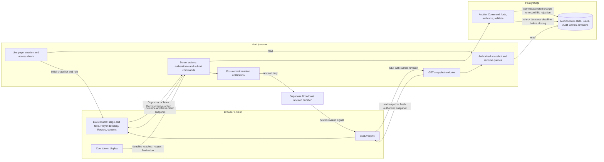
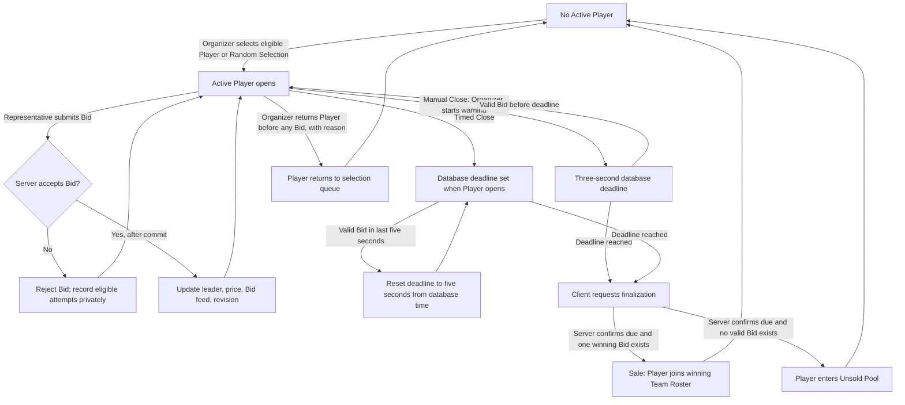

# Live Auction page flow

This describes the **current implementation** of `/app/auctions/[id]/live`. A Live Auction and a Paused Auction use the same page. The diagram separates what the browser displays or requests from what the server and PostgreSQL decide.

## Request, command, and update flow

On entry, the server requires a session and an authorized Live or Paused Auction. Otherwise the page returns 404. It passes a role-specific snapshot to `LiveConsole`. The browser can disable a control or show a warning, but a server command still checks the actor, Auction state, applicable rules, and the expected revision where required inside a PostgreSQL transaction. A Bid appears as accepted only after commit. Competing commands serialize on the Auction row.

After a command, the caller receives its outcome and a fresh snapshot. A committed change advances the Auction revision. Supabase Broadcast carries a revision signal, not the Auction data; each browser fetches its own authorized snapshot. `useLiveSync` also checks every 15 seconds with a connected socket, every 3 seconds while disconnected, and on focus, visibility, or network return. The endpoint returns `unchanged` when the caller already has the current revision. The client ignores a snapshot older than the one already shown. If a successful check has not occurred for 20 seconds, the page marks the connection stale and disables bidding.

## What happens during an offering

The representative has an exact next-price Bid button and a custom amount field. In the current code, a custom Bid may be **higher** than the next price. The server rejects a Bid when the actor does not represent the Team, the revision or presentation is stale, the Auction is paused, the deadline passed, the amount is too low or not an integer, the Team already leads, or Budget, Roster, Tier, or Legal Completion rules would be broken. Accepted Bids are visible to all participants; rejected Bid details are visible only to the Organizer and the submitting Team Representative.

For Manual Close, the Organizer can cancel the warning. A valid Bid during the warning also reopens bidding. The "Finalize now" button still has to pass the server's deadline check. For Timed Close, the countdown starts when the Player is offered. At zero, the browser shows Finalizing and requests a due-only, idempotent close. The browser clock does not decide whether a Bid was on time or whether a Sale happened.

## Other page paths

| Situation | Client | Server and database |
| --- | --- | --- |
| Organizer selects a Player | Shows eligible Players or Random Selection. | Allows one Active Player, checks the current revision and eligibility, then records the selection. |
| Organizer pauses or resumes | Shows Paused state; Bid controls stop. | Stores the remaining closing time on pause and creates a new deadline on resume. Bids during pause are rejected. |
| Organizer makes a correction while paused | Shows Cancel highest Bid, Reverse Sale, and Direct Sale controls. | Checks the reason and constraints, preserves history, writes an Audit Entry, and advances the revision. A reversed Player returns to the Unsold Pool. |
| Tier or Unsold Pool progresses | Shows Tier controls, Unsold Round, matching, and last-Player resolution when applicable. | Enforces Tier order, eligibility, Legal Completion, and Forced Assignment rules. |
| Organizer completes the Auction | Shows the completion control while paused and links to Results after success. | Requires no Active Player, open Unsold Round, unresolved Tier or Player, open Unsold Pool, or Team below its minimum. Publishes the final Results revision. |
| Participant opens Player details | Opens a details dialog. | Checks Live Auction membership for a details request. The directory snapshot itself omits phone numbers and custom fields. |

The "Live Bidding Stream" is a display of committed Bids and the latest Sale, not a text chat. There is no public Viewer on this page. The client cannot directly write Bids or Sales to PostgreSQL. A Realtime message cannot approve a Bid or replace the authorized snapshot.

## Current implementation limits

- Finalization is woken by a participant's browser request. The five-second scheduled sweep described in [ADR 0007](adr/0007-use-database-deadlines-and-idempotent-finalization.md) is not implemented in the current source. If no browser wakes the close, the stored deadline alone does not create a Sale or Unsold result. Each browser's automatic wake currently makes one attempt per presentation; a failed request is not retried automatically by that browser.
- The custom amount field accepts jump Bids above the next price in the current command code. [The product specification](product-spec.md) describes an exact next-price Bid. The exact-price button follows that specification; the custom field extends it.

## Code map

| Part | Source |
| --- | --- |
| Server page and initial access | [`src/app/app/auctions/[id]/live/page.tsx`](../src/app/app/auctions/%5Bid%5D/live/page.tsx) |
| Browser state, controls, and countdown | [`live-console.tsx`](../src/features/auctions/live/live-console.tsx), [`live-countdown.tsx`](../src/features/auctions/live/live-countdown.tsx) |
| Server actions | [`live-actions.ts`](../src/features/auctions/live/live-actions.ts) |
| Revision subscription and fallback checks | [`use-live-sync.ts`](../src/features/auctions/live/use-live-sync.ts), [`snapshot/route.ts`](../src/app/api/auctions/%5Bid%5D/snapshot/route.ts) |
| Authorization and snapshot shape | [`live-snapshot.ts`](../src/server/auction-query/live-snapshot.ts), [`live-revision.ts`](../src/server/auction-query/live-revision.ts) |
| Bid and close decisions | [`place-bid.ts`](../src/server/auction-command/place-bid.ts), [`close-player.ts`](../src/server/auction-command/close-player.ts) |
| Shared transaction, revision, and Audit Entry | [`live-command.ts`](../src/server/auction-command/live-command.ts) |
